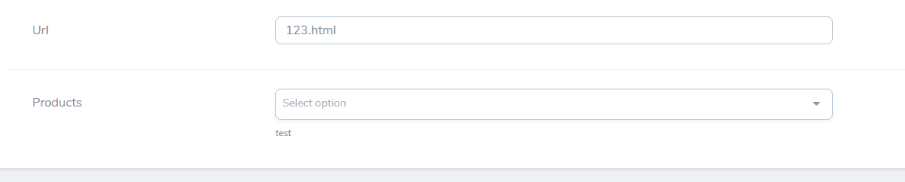

# Ajax Multiselect Nova Field
Laravel Nova package add vue-multiselect field work with ajax requests. Field values save as json string.
  


## Getting Started
### Installing

Install the package in a project via composer:

```bash
composer require bessamu/ajax-multiselect-nova-field
```

### Usage

Ajax multiselect field have a `model` option for searching by ajax queries.

```php
<?php

namespace App\Nova;

use App\Models\Catalog\Product;
use Bessamu\AjaxMultiselectNovaField\AjaxMultiselect;

class NewsResource extends Resource
{
    public function fields(Request $request)
    {
        return [
            AjaxMultiselect::make('Products', 'products')
                ->optionsModel(Product::class)
                ->optionsLabel('model')
                ->queryWhere('enabled', 1)
                ->placeholder('Select products')
                ->maxOptions(5)
        ];
    }
}
```
Option `optionsModel` required for this nova field:

- Parameter is model class string, must be extended by `Illuminate\Database\Eloquent\Model`. 

Values saved as json string in a column.

#### All options

| option         | parameters             | values   | description                                                                                                 |
|----------------|------------------------|----------|-------------------------------------------------------------------------------------------------------------|
| `optionsModel` | `string` $modelClass   | required | Required option. Set a model class to search.                                                               |
| `optionsLabel` | `string` $searchLabel  | required | Optional option. Set a label for frontend output and search models. By default searching label is `'name'`. |
| `queryWhere`   | `string` $column, `string` $value, `string` $operator = '=' | required | Optional option. Set query by a column, value and operator             |
| `placeholder`  | `string` $placeholder  | required | Optional option. Set a placeholder for vue-multiselect input.                                               |
| `maxOptions`   | `int` $max             | required | Optional option. Set the maximal number of selections and limit returned models                             | 


## Authors

* **Korotkov Pavel** - *Initial work* - [Bessamu](https://github.com/Bessamu)

See also the list of [contributors](https://github.com/Bessamu/ajax-multiselect-nova-field/graphs/contributors) who participated in this project.

## License

This project is licensed under the MIT License - see the [LICENSE.md](LICENSE.md) file for details
